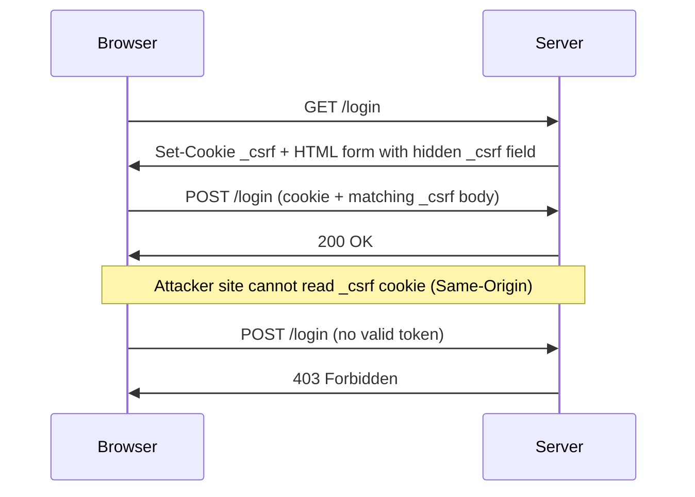

# Week 5 — Ethical Hacking & Exploiting Vulnerabilities

---

## Table of Contents

- [Overview](#overview)
- [Goals](#goals)
- [Tools & Technologies](#tools--technologies)
- [Prerequisites (Week 4)](#prerequisites-week-4)
- [Task 1 — Ethical Hacking Basics](#task-1--ethical-hacking-basics)
- [Task 2 — SQL Injection & Exploitation](#task-2--sql-injection--exploitation)
- [Task 3 — Cross-Site Request Forgery (CSRF) Protection](#task-3--cross-site-request-forgery-csrf-protection)
- [Testing & Verification](#testing--verification)
- [Deliverables Checklist](#deliverables-checklist)
- [Folder Structure](#folder-structure)

---

## Overview

Week 5 focuses on ethical hacking techniques in a controlled lab environment and applying defensive fixes to the User Management Application. Building on the Week 4 hardening (rate limiting, CORS, API keys, CSP, HSTS, Fail2Ban), this week adds **CSRF protection** using the `csurf` middleware and documents reconnaissance, SQL injection testing, and Burp Suite workflows required by the internship deliverables.

---

## Goals

- Conduct reconnaissance on the test application using a penetration testing toolkit (Kali Linux)
- Identify and document SQL injection risks (or confirm absence of SQL attack surface)
- Implement **CSRF protection** with `csurf` and `cookie-parser`
- Test forged requests using **Burp Suite** and verify they are blocked

---

## Tools & Technologies

| Tool / Library   | Purpose                                      | Environment   |
| ---------------- | -------------------------------------------- | ------------- |
| Kali Linux       | Penetration testing & ethical hacking lab    | VM            |
| Burp Suite       | Intercept/replay requests; CSRF testing        | Kali / host   |
| SQLMap           | Automated SQL injection detection              | Kali Linux VM |
| `csurf`          | CSRF token validation (Week 5 task)          | Node.js       |
| `cookie-parser`  | Cookie parsing (required by `csurf`)         | Node.js       |
| `express`        | Web application framework                    | Node.js       |
| `bcrypt`         | Password hashing (Week 1–3 fix)              | Node.js       |
| `validator`      | Input validation & XSS sanitization          | Node.js       |

---

## Prerequisites (Week 4)

The following defenses from Week 4 remain active in `app.js`:

- Fail2Ban monitoring of `security.log` for failed logins
- Global and login rate limiting (`express-rate-limit`)
- CORS restricted to `http://localhost:3000`
- API key middleware for sensitive endpoints
- CSP and HSTS via `helmet`

See git history on branch `week4-6-security` for the full Week 4 README content.

---

## Task 1 — Ethical Hacking Basics

### What to Do

Use **Kali Linux** (or your preferred toolkit) to perform reconnaissance on the running application:

```bash
# Start the app (on Windows host or Kali VM)
node app.js
# App runs at http://localhost:3000
```

Example reconnaissance steps:

```bash
# Service / port check
nmap -sV localhost -p 3000

# HTTP headers and server fingerprint
curl -I http://localhost:3000

# Directory enumeration (optional)
gobuster dir -u http://localhost:3000 -w /usr/share/wordlists/dirb/common.txt
```

Document in your **ethical hacking report**:

- Open ports and services
- HTTP security headers observed (CSP, HSTS, etc.)
- Public routes discovered (`/login`, `/register`, `/admin`, etc.)
- Authentication mechanism (session via `currentUser` + JWT on login)

---

## Task 2 — SQL Injection & Exploitation

### Application Note

This application stores users in **`users.json`** (file-based persistence), not a SQL database. There are **no raw SQL queries** in the backend, so classic SQL injection against the app logic is **not applicable**.

### SQLMap (Lab Exercise)

You can still run SQLMap against login/register endpoints to confirm no SQL backend is exposed:

```bash
sqlmap -u "http://localhost:3000/login" --data="username=test&password=test" --batch
```

Expected outcome: no injectable SQL parameters (file/JSON storage only).

### Prepared Statements (Best Practice)

If a SQL database is added later, use **parameterized queries** — never concatenate user input into SQL:

```javascript
// SAFE — parameterized query (example for future MySQL/PostgreSQL integration)
const [rows] = await db.execute(
  'SELECT * FROM users WHERE username = ?',
  [username]
);

// UNSAFE — never do this
// const query = `SELECT * FROM users WHERE username = '${username}'`;
```

---

## Task 3 — Cross-Site Request Forgery (CSRF) Protection

### What Was Implemented

**CSRF protection** was added using the **`csurf`** middleware with the **double-submit cookie** pattern (`cookie: true`). Every state-changing `POST` request must include a token that matches the secret stored in the `_csrf` cookie.

---

### 3.1 — Package Installation

```bash
npm install csurf cookie-parser
```

Dependencies are listed in `package.json`:

- `csurf` — CSRF middleware (archived but required by the Week 5 task spec)
- `cookie-parser` — parses cookies so `csurf` can read/write the CSRF secret

---

### 3.2 — Middleware Setup

Middleware order in `app.js`:

1. `cookieParser()`
2. `bodyParser.urlencoded()`
3. `csrf({ cookie: true })`

```javascript
const cookieParser = require('cookie-parser');
const csrf = require('csurf');

app.use(cookieParser());
app.use(bodyParser.urlencoded({ extended: true }));
app.use(csrf({ cookie: true }));
```

---

### 3.3 — CSRF Token in HTML Forms

A helper embeds a hidden field on every form served to the browser:

```javascript
function getCsrfField(req) {
  return `<input type="hidden" name="_csrf" value="${req.csrfToken()}">`;
}
```

Protected forms include:

| Route | Method | Purpose |
| ----- | ------ | ------- |
| `/register` | POST | User registration |
| `/login` | POST | Authentication |
| `/profile/edit` | POST | Profile update |
| `/password/change` | POST | Password change |
| `/admin/users/:username/delete` | POST | Delete user |
| `/admin/users/:username/edit` | POST | Edit user |
| `/admin/users/add` | POST | Add user |
| `/admin/reset-all` | POST | Reset all users |

Example in a form template:

```html
<form method="POST" action="/login">
  <input type="hidden" name="_csrf" value="TOKEN_FROM_req.csrfToken()" />
  <!-- other fields -->
</form>
```

---

### 3.4 — CSRF Token for AJAX (Import Users)

The admin dashboard file import uses `fetch()` with a token in the **`x-csrf-token`** header (supported by `csurf`):

```html
<meta name="csrf-token" content="${req.csrfToken()}">
```

```javascript
const csrfToken = document.querySelector('meta[name="csrf-token"]').content;
fetch('/admin/import', {
  method: 'POST',
  headers: { 'x-csrf-token': csrfToken },
  body: formData,
});
```

---

### 3.5 — CSRF Error Handler

Invalid or missing tokens return **403 Forbidden** and are logged:

```javascript
app.use((err, req, res, next) => {
  if (err.code !== 'EBADCSRFTOKEN') return next(err);
  logger.warn('CSRF token validation failed', { path: req.path, ip: req.ip });
  res.status(403).send(/* forbidden page */);
});
```

---

### How CSRF Protection Works



---

## Testing & Verification

### CSRF — Valid Request (Browser)

1. Start the app: `node app.js`
2. Open `http://localhost:3000/login`
3. Submit login with valid credentials → **should succeed**

---

### CSRF — Burp Suite (Forged Request)

1. Log in and capture a `POST /login` (or any form POST) in Burp Proxy
2. Send to **Repeater**
3. Remove the `_csrf` field (or replace with an invalid value)
4. Replay the request → expect **403** with message about invalid CSRF token

Alternative: create a simple HTML page on another origin that auto-submits a form to your app — the browser will not include a valid token → request blocked.

---

### CSRF — curl (Missing Token)

```bash
curl -X POST http://localhost:3000/login \
  -H "Content-Type: application/x-www-form-urlencoded" \
  -d "username=admin&password=test123"
```

Expected: **403 Forbidden** (no `_csrf` cookie/token pair)

---

### SQLMap — No SQL Surface

```bash
sqlmap -u "http://localhost:3000/login" \
  --data="username=test&password=test&_csrf=invalid" --batch
```

Document that the app uses JSON file storage, not SQL.

---

## Deliverables Checklist

- [ ] Ethical hacking report with reconnaissance findings (Kali tools)
- [ ] SQLMap scan results documented (no SQLi on current JSON backend)
- [x] `csurf` and `cookie-parser` installed
- [x] CSRF middleware applied globally (`csrf({ cookie: true })`)
- [x] Hidden `_csrf` field on all HTML forms
- [x] `x-csrf-token` header on AJAX `/admin/import`
- [x] 403 error handler for `EBADCSRFTOKEN`
- [ ] Burp Suite test evidence (valid vs forged POST screenshots)
- [x] `.env.example` notes for Week 5 CSRF testing
- [ ] Changes committed to `week4-6-security` branch

---

## Folder Structure

```
user-management-app/
├── app.js                  ← Week 4 hardening + Week 5 CSRF (csurf)
├── .env                    ← Secrets (NOT in GitHub)
├── .env.example            ← JWT_SECRET, API_KEY, CSRF notes
├── .gitignore
├── package.json            ← includes csurf, cookie-parser
├── package-lock.json
├── users.json              ← Local user data (gitignored — never commit)
├── users.json.example      ← Safe template for cloning the repo
├── security.log            ← Winston security events (gitignored)
├── public/
│   └── css/style.css
└── README.md               ← This file (Week 5)
```

---

## Key Security Notes

> **CSRF vs CORS:** CORS blocks *reading* cross-origin responses; CSRF blocks *unauthorized state-changing requests* from other sites. Both are required for defense in depth.

> **csurf maintenance:** The `csurf` package is archived but used here because the internship task explicitly requires it. For new production projects, consider maintained alternatives (e.g. `csrf-csrf`).

> **Session model:** Route protection still relies on server-side `currentUser`. JWT is issued on login; full JWT middleware on all routes remains a future improvement.

> **No SQL database:** SQL injection mitigations (prepared statements) apply when/if a SQL backend is integrated. Current storage is `users.json`.

---

_DeveloperHub Cybersecurity Internship — Week 5_
